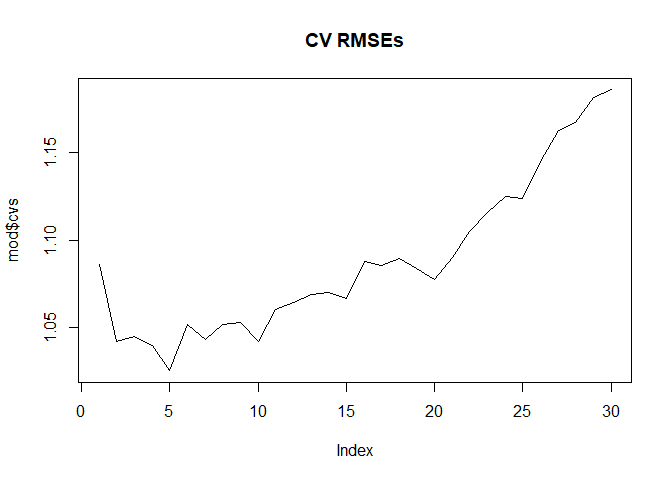
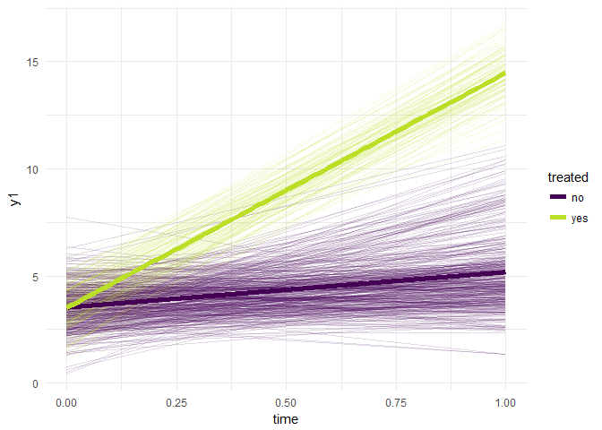
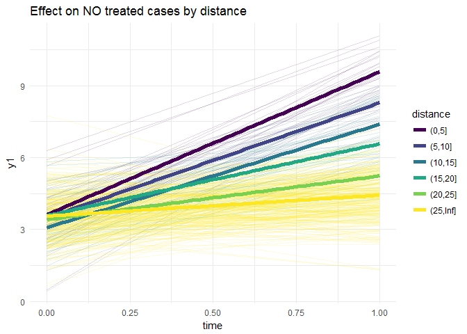

<!-- README.md is generated from README.Rmd. Please edit that file -->
cdifdif
=======

The goal of cdifdif is to ...

Example
-------

This is a basic example which shows you how to solve a common problem:

``` r
library(cdifdif)

data("spilloverDGP")

str(spilloverDGP)
#> Classes 'tbl_df', 'tbl' and 'data.frame':    1000 obs. of  8 variables:
#>  $ id   : int  1 1 2 2 3 3 4 4 5 5 ...
#>  $ dist : num  0 0.25 0 0.5 0 0.75 0 1 0 1.25 ...
#>  $ x    : num  0.774 0.774 0.892 0.892 0.797 ...
#>  $ time : int  0 1 0 1 0 1 0 1 0 1 ...
#>  $ treat: int  0 0 0 0 0 0 0 0 0 0 ...
#>  $ y1   : num  3.92 10.44 3.3 9.38 5.92 ...
#>  $ y2   : num  3.1 8.88 4.38 8.82 2.57 ...
#>  $ y3   : num  13.3 14.7 14.7 14.4 14.3 ...

mod <- cdifdif(y1 ~ time + treat, data = spilloverDGP, dist = spilloverDGP$dist,
               maxDist = 30, delta = 1, alpha = 0.05, k = 10, verbose = FALSE)
```

We can obtain all the CV-RMSE and plot them.

``` r
plot(mod$cvs, type = "l", main = "CV RMSEs")
```



And get the model where we obtain that error:

``` r
nmod <- which.min(mod$cvs)
nmod
#> [1] 5

mod$cvs[[nmod]]
#> [1] 1.028417
```

And then the model:

``` r
library(broom) # tidy function

tidy(mod$mods[[nmod]]) 
#>          term   estimate  std.error statistic      p.value
#> 1 (Intercept)  3.5224125 0.04570940 77.061012 0.000000e+00
#> 2          t1  0.9086385 0.07464314 12.173102 7.143690e-32
#> 3          t2 10.0449985 0.11802116 85.111844 0.000000e+00
#> 4          d1  5.1403294 0.23604232 21.777152 3.014455e-86
#> 5          d2  3.8497968 0.23604232 16.309774 3.681743e-53
#> 6          d3  2.9614936 0.23604232 12.546452 1.276843e-33
#> 7          d4  2.1429545 0.23604232  9.078688 5.793737e-19
#> 8          d5  0.8046168 0.23604232  3.408782 6.787871e-04
```

5 intervals we have. We can visualize:

``` r
library(dplyr)
#> 
#> Attaching package: 'dplyr'
#> The following objects are masked from 'package:stats':
#> 
#>     filter, lag
#> The following objects are masked from 'package:base':
#> 
#>     intersect, setdiff, setequal, union
library(ggplot2)
library(tidyr)
library(viridis)
#> Loading required package: viridisLite

step <- mod$steps[[nmod]]
step
#> [1] 5

cuts <- c(seq(0, 5), Inf) * step
cuts
#> [1]   0   5  10  15  20  25 Inf

spilloverDGP21 <- spilloverDGP %>% 
  filter(treat == 1) %>% 
  distinct(id) %>% 
  mutate(treated = "yes")

spilloverDGP22 <- spilloverDGP %>% 
  filter(treat == 0, time == 1) %>% 
  select(id, dist) %>% 
  mutate(distance = cut(dist, cuts, include.lowest = FALSE)) %>% 
  select(id, distance)

spilloverDGP <- spilloverDGP %>% 
  left_join(spilloverDGP21) %>% 
  left_join(spilloverDGP22) %>% 
  mutate(treated = ifelse(is.na(treated), "no", "yes"))
#> Joining, by = "id"
#> Joining, by = "id"
spilloverDGP  
#> # A tibble: 1,000 x 10
#>       id  dist         x  time treat        y1       y2       y3 treated
#>    <int> <dbl>     <dbl> <int> <int>     <dbl>    <dbl>    <dbl>   <chr>
#>  1     1  0.00 0.7735721     0     0  3.923192 3.096643 13.31439      no
#>  2     1  0.25 0.7735721     1     0 10.437510 8.877026 14.66957      no
#>  3     2  0.00 0.8924938     0     0  3.302063 4.381316 14.71550      no
#>  4     2  0.50 0.8924938     1     0  9.384268 8.819533 14.44591      no
#>  5     3  0.00 0.7974548     0     0  5.920908 2.574780 14.31268      no
#>  6     3  0.75 0.7974548     1     0 10.604140 8.025814 14.73039      no
#>  7     4  0.00 0.2268097     0     0  2.640629 3.574981 14.22123      no
#>  8     4  1.00 0.2268097     1     0  6.870143 9.278002 11.83855      no
#>  9     5  0.00 0.0874876     0     0  4.320655 3.107874 11.86885      no
#> 10     5  1.25 0.0874876     1     0  9.300032 9.220352 12.40277      no
#> # ... with 990 more rows, and 1 more variables: distance <fctr>


ggplot(spilloverDGP, aes(x = time, y = y1)) +
  geom_line(aes(group = id, color = treated), alpha = 0.15) +
  geom_smooth(aes(color = treated), se = FALSE, lwd = 2, method = "lm") +
  scale_color_viridis(discrete = TRUE, end = 0.9)
```



``` r


spilloverDGP %>% 
  filter(treated == "no") %>%
  ggplot(aes(x = time, y = y1)) +
  geom_line(aes(group = id, color = distance), alpha = 0.15) +
  geom_smooth(aes(color = distance), se = FALSE, lwd = 2, method = "lm") +
  scale_color_viridis(discrete = TRUE) +
  labs(title = "Effect on NO treated cases by distance")
```


